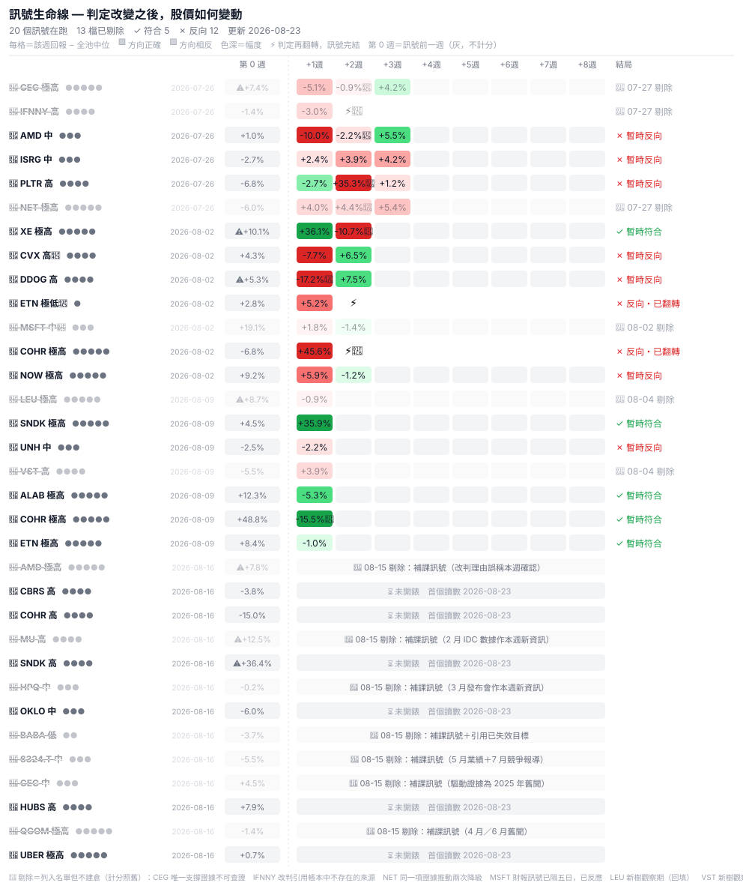

# 📊 draw-tree 訊號板

> 更新於 2026-07-27（每週日名單發佈後自動重生成；數據源＝公開名單帳本 [`portfolio/verdict_watch.jsonl`](portfolio/verdict_watch.jsonl)＋各樹每週快照價，人手零落數）。超額＝該股一週回報 − 全池中位；研究用途，非投資建議。

## 本週發生了什麼（名單日 2026-07-26）（非正式：名單早於預登記正式起始日，不入正式比分）

本週 73 棵樹掃描完成：🔺 升級 3 檔｜🔻 降級 3 檔｜⚖️ 混合不入名單 1 檔

### 🔻 降級（研究上預期其後跑輸全池）

| 股票 | 訊號前一週 | 最重等級 | 訊號 | 觸發 | 判定變化 |
|---|---|---|---|---|---|
| **ISRG** | -2.3% | 明顯受損 | -0.9 | 🗓️ 週掃描 | B1 Trending negative→Approaching falsification |
| **PLTR** | -7.1% | 重創 | -1.6 | 🗓️ 週掃描 | B2 Approaching falsification→Falsified |
| **NET** | -5.6% | 致命 | -2.5 | 🗓️ 週掃描 | A3 Approaching falsification→Falsified |

### 🔺 升級（預期跑贏）

| 股票 | 訊號前一週 | 最重等級 | 訊號 | 觸發 | 判定變化 |
|---|---|---|---|---|---|
| **AMD** | ⚠ +5.3% | 明顯受損 | +0.9 | 🗓️ 週掃描 | D3 Trending positive→Validated |
| **IFNNY** | — | 重創 | +1.6 | 🗓️ 週掃描 | C3 Trending positive→Validated |
| **CEG** | ⚠ +8.7% | 致命 | +2.5 | 🗓️ 週掃描 | C2 Trending negative→Validated |

> 「訊號前一週」＝**判定改變之前**那一週該股的升跌，並非其後的表現。⚠ 標示訊號發出前已朝同方向走過者（升級側 >+5%／降級側 <-8%）——該段或已被市場計入。此為披露，不影響入選。

### ⛔ 列入名單但不入建倉籃

**NET**　_判定與自身條件紀錄矛盾，且證據重複計算_（2026-07-27 由maintainer裁定）
- NET 本週訊號完全來自單一片葉 A3（致命級，訊號 -2.5）。
- 該葉 07-25 由『接近證偽』改判『已證偽』，理由為『Google 已於 2026 年 4 月推出 Gemini Enterprise Agent Platform 及其 Agent Gateway，直接滿足證偽條件 A3-F1』。
- 但同一件事實已於 06-06 用作『已確認→接近證偽』的理由。同一單證據推動了兩次連續降級，中間並無新資料入帳（lag_days=53）。
- 更關鍵：該葉自身的結構化欄位與判定互相矛盾——conditions[A3-F1].status='open'、condition_assessments[A3-F1]='approaching'，而判定理由卻聲稱該條件『直接滿足』並落至 Falsified。
- 全庫同類矛盾共 14 片葉（判定落證偽區、但無任何一條證偽條件評為 met）。本次僅處置 NET；ISRG B1 有同一矛盾但 lag_days=9（證據新鮮，屬條件欄位未同步而非重複計算），TSLA B2 亦有但該檔本週為 mixed，本就不入籃。

> 計分板**仍按原名單計分**：排除影響的是實際建倉，不是訊號的成績。把兩者分開，「訊號準不準」與「我們有沒有照單全收」才不會互相污染。

## 訊號生命線

每個訊號一行：名單公開後逐週相對全池的表現（綠＝跑贏、紅＝跑輸，色深＝幅度），**⚡＝判定翻轉**（訊號生命完結）。降級訊號整行應為紅、升級整行應為綠——預測正確與否，一眼看完。

截至 2026-07-27：追蹤中訊號 6 個｜✓ 符合 0｜✗ 反向 0。

| 訊號 | 名單日 | +1 週 | +2 週 | +3 週 | +4 週 | +5 週 | +6 週 | +7 週 | +8 週 | 累計 | 結局 |
|---|---|---|---|---|---|---|---|---|---|---|---|
| 🔺 **AMD** +0.9 | `2026-07-26` | — | — | — | — | — | — | — | — | — | ⏳ 尚未開錶 |
| 🔻 **ISRG** -0.9 | `2026-07-26` | — | — | — | — | — | — | — | — | — | ⏳ 尚未開錶 |
| 🔺 **IFNNY** +1.6 | `2026-07-26` | — | — | — | — | — | — | — | — | — | ⏳ 尚未開錶 |
| 🔻 **PLTR** -1.6 | `2026-07-26` | — | — | — | — | — | — | — | — | — | ⏳ 尚未開錶 |
| 🔺 **CEG** +2.5 | `2026-07-26` | — | — | — | — | — | — | — | — | — | ⏳ 尚未開錶 |
| 🔻 **NET** -2.5 | `2026-07-26` | — | — | — | — | — | — | — | — | — | ⏳ 尚未開錶 |

_每行的 +N 週相對該行自己的名單日；不同名單日的同一欄並非同一個日曆週。_

方法一句話：名單先公開、後對答案（append-only 帳本）；混合週（同股同週有升有降）依純度規則不入名單；財報觸發之訊號以事件日收盤開錶。詳見 [`calibration/SPEC.md`](calibration/SPEC.md)。

*研究用途，非投資建議。*